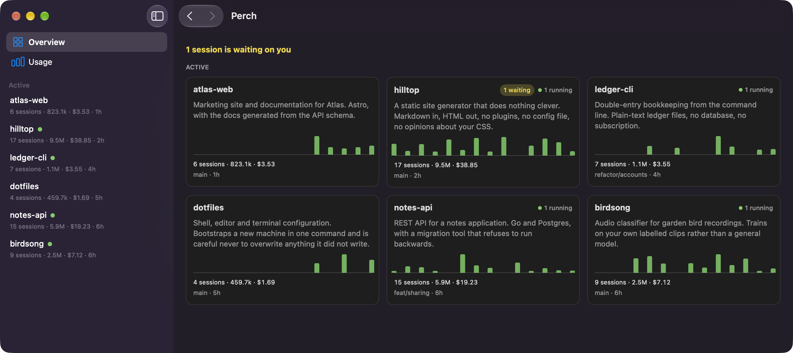

# Perch

A menu bar app that tells you when a Claude Code session is waiting on you.



> **Status:** early. I use it every day, but it's pre-1.0 and some of the
> numbers come with caveats. They're listed below rather than buried.

Perch is an independent project. It isn't affiliated with Anthropic, or
endorsed or sponsored by them.

## Why I wrote it

I once left a session waiting for 32 hours. It was sitting on a permission
prompt, behind a fullscreen window, in a terminal tab I'd forgotten about.

Perch reads the files Claude Code already writes to your disk and keeps a
summary in your menu bar, so you can glance up and see what's running and
what's stuck.

## Nothing leaves your Mac

Your transcripts have your source code in them, and probably a few things you
pasted in without thinking too hard about it. So Perch doesn't send them
anywhere. It doesn't send anything anywhere.

* **There's no network code.** No HTTP library in the build, no sockets in the
  source. CI fails if anyone adds one, or writes an `http://` address into the
  app at all.
* **No analytics, no crash reports.** There's no setting to turn off. It was
  never there.
* **It doesn't write to your Claude Code folder.** Perch only reads it. Its own
  database and settings live elsewhere, in
  `~/Library/Application Support/Perch/`. CI fails if a file-writing call shows
  up where it shouldn't.
* **It doesn't keep what it reads.** Perch counts tokens and works out what
  state a session is in. What your conversations actually say never reaches a
  window, a notification, a log file, or the MCP server.

A later version may add one outbound host, `anthropic.com`, to read your own
rate limit status. It isn't in the code today, and this section will change
before it is.

## Installing

You need macOS 15 or later.

Download the latest `.zip` from
[Releases](https://github.com/amirdaraee/perch/releases/latest), unzip it, and
drag `Perch.app` into your Applications folder.

**The first time you open it, macOS will stop you.** I haven't paid Apple $99 a
year for a developer certificate, so as far as your Mac is concerned Perch comes
from a stranger. To get past it, open **System Settings**, go to **Privacy &
Security**, scroll to the bottom, and click **Open Anyway**.

On macOS 15 that's the only way in. Right-clicking and choosing Open used to
work and doesn't any more. If you'd rather not run an unsigned binary you
downloaded from someone's website, that seems fair enough to me given what this
thing reads, and [building it yourself](#building-it-yourself) is two commands.

## What it does

Perch sits in the menu bar with no Dock icon and shows how many sessions are
live. Clicking it opens a menu with your usage and a row per session. It's a
real `NSMenu`, which is what keeps it visible when you're in a fullscreen app.

**Open Perch** opens the main window. You get a card per project with its
README blurb, session count, tokens, spend, a two week chart, and whether
anything is running or waiting right now. Click through for that project's
sessions, your own notes, and its totals. There's a separate Usage view with
everything broken down by day, by project and by model.

From a project you can pin it, archive it, rename it, resume a session
(`claude --resume <id>`), or start a new one. Both open in the project's folder,
in whichever terminal you use. Perch looks for Terminal, iTerm2, Warp, Ghostty,
Alacritty, Kitty and WezTerm, and launches your choice by writing a one-shot
script into its own folder and asking `NSWorkspace` to open it. Doing it that
way avoids the Automation permission prompt an AppleScript approach needs.

**The waiting-on-you notification** is the reason the whole thing exists. Turn
it on and Perch tells you once when a session has been waiting longer than you
want. Any project can have its own limit, or none at all. macOS asks for
notification permission at that point rather than at launch, and if you say no
the toggle says so instead of quietly doing nothing.

**Settings** (⌘,) has nine panes and a search box, so you can find a setting by
what it does instead of guessing which pane it's in. Each pane shows what your
current settings actually produce in your own data. Settings live in Perch's own
`config.toml`, which is watched, so editing it by hand works without a restart.

**Diagnostics**, in Settings, answers "why isn't my session showing up?". For
every session record it found, it says whether it was accepted or exactly why it
wasn't: no such process, that pid isn't `claude`, or the record wouldn't parse.

### Things worth knowing

* **The totals are a floor, not a total.** Perch indexes the top-level `.jsonl`
  transcripts in each project folder. Subagent transcripts, under
  `<session-id>/subagents/`, aren't indexed yet even though that work is billed
  separately, so your real usage is higher than what Perch shows. Sometimes a
  lot higher.
* **The model prices are placeholders.** I haven't verified them. You can edit
  them in the Prices pane. If a model has no price, Perch counts its tokens and
  says it doesn't know the cost rather than showing you a zero.
* **The fullscreen behaviour is right by construction, not by testing.** A
  tracked `NSMenu` is the documented way to stay visible over a fullscreen app,
  and two spikes confirmed the alternatives don't work. Nobody has actually
  confirmed it on a second display yet.

## MCP server

There's a small read-only MCP server inside the app bundle, so Claude Code can
ask about your own projects and usage.

```bash
claude mcp add --scope user perch -- /Applications/Perch.app/Contents/MacOS/perch-mcp
```

Settings → Advanced has that line with your actual path, ready to copy.

Four tools: `list_projects`, `get_project`, `live_sessions`, `usage_summary`. It
opens the database in read-only mode, so SQLite itself refuses writes rather
than the code merely avoiding them, and it has no network code in it. Every
answer carries `index_updated_at`, so you can tell how fresh it is.

## Building it yourself

You need macOS 15 or later, [Rust](https://rustup.rs) and Swift 6.

```bash
scripts/build-xcframework.sh        # builds perch-ffi, emits the xcframework + Swift bindings
cd apps/macos/Perch && make bundle  # builds and bundles build/Perch.app
open build/Perch.app
```

`apps/macos/Perch` is a SwiftPM executable; there's no Xcode project. The
xcframework and the generated Swift bindings are build output and git-ignored.
Always regenerate them rather than trusting a copy someone checked in, which is
a classic way to get very confusing FFI bugs.

## Just the numbers

If you only want the data, the CLI needs nothing but Rust:

```bash
cargo run --release -p perch-cli -- index
cargo run --release -p perch-cli -- projects
cargo run --release -p perch-cli -- usage
cargo run --release -p perch-cli -- models
```

Perch looks for your Claude Code folder at `$CLAUDE_CONFIG_DIR`, then
`$XDG_CONFIG_HOME/claude`, then `~/.claude`. `--config-dir` overrides it.

## How it works

Transcripts only ever get appended to, so Perch remembers a byte offset per file
and only re-reads what's new. Indexing 120 MB happens once; after that each pass
costs microseconds per active session.

Project paths come from the `cwd` field inside the transcripts, never from
decoding the folder name. That encoding flattens both `/` and `.` into `-`, so
`-Users-me-code-someone-github-io` is ambiguous and decoding it picks the wrong
folder about as often as the right one.

Everything the UI displays is built in Rust (`perch-core`) and handed to Swift
through [UniFFI](https://github.com/mozilla/uniffi-rs), including the em dash
that means "I don't know" and the "N sessions are waiting on you" line. Swift
draws; it doesn't format numbers. CI fails if a Swift `Text` ever does. The
reason is that a Linux or Windows version later on should be able to reuse all
of it, and anything reimplemented is something that can disagree.

```
crates/perch-core   parsing, index, settings, and every string the UI shows
crates/perch-cli    the data layer on its own
crates/perch-ffi    the UniFFI surface the macOS app is built on
crates/perch-mcp    the read-only MCP server
apps/macos/Perch    the SwiftUI/AppKit app
```

## Contributing

Please read [CONTRIBUTING.md](CONTRIBUTING.md) first. It lists the rules CI
enforces — read-only, no network, no new dependencies, Rust owns every string —
and you can't guess them from reading the source.

## License

[MIT](LICENSE).
